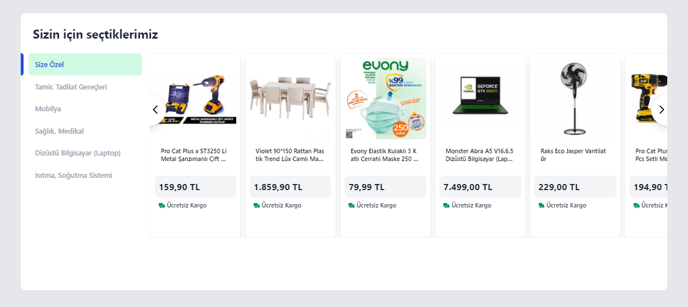
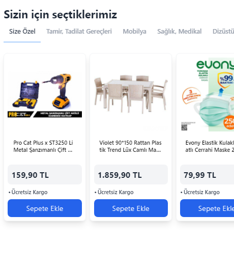

# Product List Component

A simple vanilla js application that dynamically retrieves the product list.

## Web View


## Mobile View


# Features

- Web and mobile design of all pages
- 'Special for you' homepage
- 6 categories navigation bar list
- +20 product list in each category
- Slide feature of product lists
- Add to cart feature

## Installation

Clone the project. (https://github.com/mertaktas/Product-List-Component.git)

```
git clone https://github.com/mertaktas/Product-List-Component.git
```

## Usage

After cloning the project, open it in the IDE.

```
cd Product-List-Component
code .
```

## Project setup

Installation of the project

```
npm install
```

### Run The Server
```
npm run json-server
```

## License
[MIT](https://choosealicense.com/licenses/mit/)